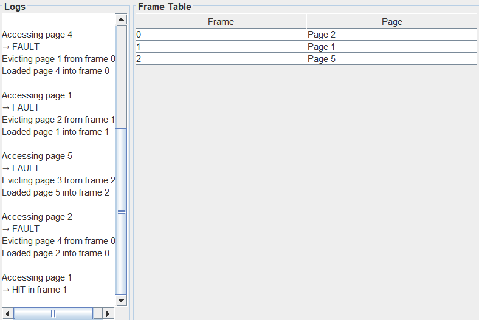

# Virtual Memory Magician 🧙‍♂️

A Java-based **Virtual Memory Simulator** with a graphical user interface that demonstrates how operating systems manage virtual memory, page loading, and page replacement using the FIFO (First-In-First-Out) algorithm.


> *Add your screenshot as `screenshot.png` in the root directory*

## 📋 Overview

This project simulates the behavior of virtual memory management in modern operating systems. It visualizes how pages are loaded into limited physical memory (frames), how page faults occur, and how the FIFO page replacement policy decides which page to evict when memory is full.

## ✨ Features

- **Interactive GUI**: Easy-to-use Swing-based interface for visualizing memory operations
- **Real-time Visualization**: 
  - Frame table showing current memory state
  - Live logging of page hits, faults, and evictions
- **Flexible Input**: 
  - Step through a predefined access sequence
  - Enter custom page numbers manually
  - Run entire sequence at once
- **FIFO Page Replacement**: Implements First-In-First-Out replacement policy
- **Statistics Tracking**: 
  - Page hit count
  - Page fault count
  - Fault rate calculation
- **Reset Functionality**: Restart simulation anytime

## 🏗️ Architecture

The project consists of the following key components:

### Core Classes

- **`VirtualMemorySimulatorUI.java`**: Main GUI application with controls and visualization
- **`MemoryManager.java`**: Core logic for managing page table, frames, and memory access
- **`PageTableEntry.java`**: Represents an entry in the page table (valid/invalid bit, frame number)
- **`ReplacementPolicy.java`**: Interface for page replacement algorithms
- **`FIFOReplacement.java`**: FIFO page replacement policy implementation
- **`Main.java`**: CLI version for command-line testing

## 🚀 Getting Started

### Prerequisites

- Java Development Kit (JDK) 8 or higher
- Any Java IDE (IntelliJ IDEA, Eclipse, NetBeans) or command line

### Running the Application

#### Option 1: Using an IDE
1. Clone or download this repository
2. Open the project in your Java IDE
3. Run `VirtualMemorySimulatorUI.java` as the main class

#### Option 2: Command Line
```bash
# Navigate to the src directory
cd virtual-memory-magician/src

# Compile all Java files
javac *.java

# Run the GUI application
java VirtualMemorySimulatorUI
```

#### Option 3: CLI Version
```bash
# Run the command-line version
java Main
```

## 🎮 How to Use

1. **Launch the Application**: Run `VirtualMemorySimulatorUI`

2. **Simulation Controls**:
   - **Next Access**: Process the next page in the predefined sequence (1, 2, 3, 2, 4, 1, 5, 2, 1)
   - **Page Input**: Enter a custom page number and click "Next Access"
   - **Run All**: Execute the entire predefined access sequence at once
   - **Reset**: Clear all data and restart the simulation

3. **Understanding the Display**:
   - **Logs Panel**: Shows detailed information about each page access
     - `HIT`: Page found in memory
     - `FAULT`: Page not in memory, needs to be loaded
     - Eviction messages when frames are full
   - **Frame Table**: Displays current state of physical memory frames
     - Shows which pages are loaded in each frame
     - `FREE` indicates empty frames

4. **Summary Statistics**: After running the simulation, view:
   - Total page hits
   - Total page faults
   - Fault rate percentage

## 📊 Example Output

```
Accessing page 1
→ FAULT
Loaded page 1 into free frame 0

Accessing page 2
→ FAULT
Loaded page 2 into free frame 1

Accessing page 3
→ FAULT
Loaded page 3 into free frame 2

Accessing page 2
→ HIT in frame 1

Accessing page 4
→ FAULT
Evicting page 1 from frame 0
Loaded page 4 into frame 0

===== SUMMARY =====
Hits: 3
Faults: 6
Fault Rate: 66.67%
```

## 🔧 Configuration

Default settings (can be modified in the code):
- **Number of Pages**: 10 (virtual pages 0-9)
- **Number of Frames**: 3 (physical memory frames)
- **Access Sequence**: [1, 2, 3, 2, 4, 1, 5, 2, 1]
- **Replacement Policy**: FIFO

To modify these settings, edit the constructor in `VirtualMemorySimulatorUI.java` or `Main.java`.

## 🧠 How It Works

### Page Table
Each page has a Page Table Entry containing:
- **Valid bit**: Indicates if the page is in physical memory
- **Frame number**: Which frame the page occupies (if valid)

### FIFO Algorithm
- Maintains a queue of frame numbers
- When a page fault occurs and all frames are full:
  1. The oldest frame (first in queue) is selected for eviction
  2. The page in that frame is invalidated
  3. The new page is loaded into the freed frame
  4. The frame is added to the end of the queue

## 📚 Learning Objectives

This simulator helps understand:
- Virtual memory concepts and address translation
- Page faults and their causes
- Page replacement algorithms (FIFO)
- The trade-off between memory size and page faults
- The importance of locality of reference in program execution

## 🛠️ Future Enhancements

Potential improvements:
- [ ] Additional replacement algorithms (LRU, Optimal, Clock)
- [ ] Configurable memory size via GUI
- [ ] Visual animation of page replacement
- [ ] Reference string input from file
- [ ] Comparison mode for multiple algorithms
- [ ] Working set visualization
- [ ] TLB (Translation Lookaside Buffer) simulation

## 📝 License

This project is open source and available for educational purposes.

## 👥 Contributing

Feel free to fork this project and submit pull requests for improvements or bug fixes.

## 📧 Contact

For questions or suggestions, please open an issue in the repository.

---

**Note**: This is an educational project designed to help students understand virtual memory management concepts in operating systems.
